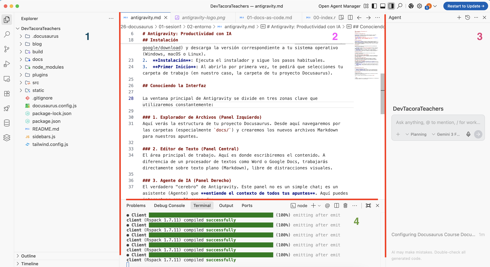

# Antigravity: Productividad con IA

Para este curso no usaremos un editor de código tradicional. Utilizaremos **Antigravity**, una plataforma de desarrollo de vanguardia diseñada específicamente para la era de la IA.

  

## ¿Qué es Antigravity?

**Antigravity** es un potente asistente de codificación agentica diseñado por el equipo de **Google DeepMind** que trabaja en *Advanced Agentic Coding*. A diferencia de un editor de texto convencional, Antigravity está construido desde cero para colaborar con agentes de IA que pueden razonar, planificar y ejecutar tareas complejas de programación.

## Instalación

Antigravity se distribuye como una aplicación de escritorio optimizada para flujos de trabajo profesionales:

1.  **Descarga**: Accede al [portal oficial de Antigravity](https://antigravity.google/download) y descarga la versión correspondiente a tu sistema operativo (Windows, macOS o Linux).
2.  **Instalación**: Ejecuta el instalador y sigue los pasos habituales.
3.  **Primer Inicio**: Al abrirlo por primera vez, te pedirá que selecciones tu carpeta de trabajo (en nuestro caso, la carpeta de tu proyecto Docusaurus).

## Conociendo la Interfaz

La ventana principal de Antigravity se divide en cuatro zonas clave que utilizaremos constantemente:

### 1. Explorador de Archivos (Panel Izquierdo)
Aquí verás la estructura de tu proyecto Docusaurus. Desde aquí navegaremos por las carpetas (especialmente `docs/`) y crearemos los nuevos archivos Markdown para nuestros apuntes.

### 2. Editor de Texto (Panel Central)
El área principal de trabajo. Aquí es donde escribiremos el contenido. A diferencia de un procesador de textos como Word o Google Docs, trabajarás directamente sobre texto plano (Markdown), libre de distracciones visuales.

### 3. Agente de IA (Panel Derecho)
El verdadero "cerebro" de Antigravity. Este panel no es un simple chat; es un asistente (Agente) que **entiende el contexto de todos tus apuntes**. Aquí puedes interactuar con IA capaz de:
*   **Generar Estructura**: "Agente, crea un índice de 5 niveles para un tema de Redes Locales".
*   **Crear Ejemplos**: "Dame 3 ejemplos de código en Python sobre bucles for".
*   **Adaptar el Tono**: "Reescribe este texto para que lo entienda un alumno de 1º de la ESO".

### 4. Terminal (Panel Inferior)
Desde aquí ejecutaremos los comandos para previsualizar nuestra web o para publicarla. Antigravity integra una terminal completa para que no tengas que cambiar de aplicación constantemente.

:::tip[TIP: Terminal oculta]
Si no ves la terminal al abrir el editor, puedes abrirla desde el menú superior **Terminal > New Terminal** o usando el atajo de teclado `Ctrl + Shift + \` (o `Cmd + J` en Mac).
:::

