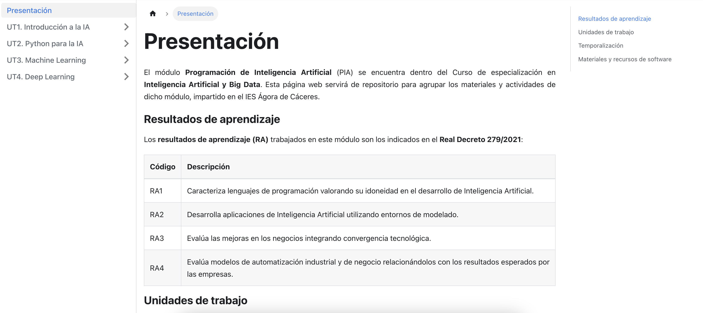
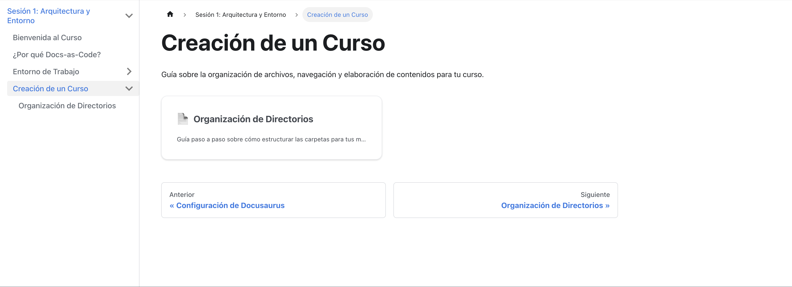

# Organización de Directorios

Antes de ponernos a escribir en Markdown, es fundamental diseñar cómo vamos a organizar nuestros apuntes en el disco duro. Una buena organización inicial nos evitará dolores de cabeza futuros cuando tengamos muchos archivos, queramos reutilizar material o si impartimos varios módulos distintos.

En Docusaurus, **toda la magia ocurre dentro de la carpeta `docs/`**. Docusaurus lee esta carpeta y construye automáticamente el menú lateral y la navegación basándose en las carpetas y archivos que encuentre.

---

## Supuesto Práctico: Nuestros Módulos

Vamos a plantearlo de forma práctica. Imagina que como profesor impartes dos módulos diferentes:
1. **PIA** (Programación de Inteligencia Artificial) en el curso de especialización de CEIABD.
2. **PMDM** (Programación Multimedia y Dispositivos Móviles) en 2º de DAM.

Para mantener todo ordenado, la regla de oro es: **crea una carpeta independiente por cada módulo dentro de `docs/`**.

### El uso del "Curso Académico"

Una buena práctica cuando somos docentes es añadir el curso escolar como prefijo en el nombre de la carpeta de nuestros módulos (por ejemplo, `2526-`).

```text title="Estructura en la carpeta docs/"
📁 docs/
 ├── 📁 2526-pia/   (Apuntes del módulo PIA para el curso 25-26)
 └── 📁 2526-pmdm/  (Apuntes del módulo PMDM para el curso 25-26)
```

:::tip[¿Por qué poner el curso académico (2526-)?]
Si el año que viene impartes el mismo módulo pero decides cambiar el temario, puedes crear una copia de la carpeta y llamarla `2627-pmdm`. Así mantienes la historia de tus apuntes intacta año tras año y no "rompes" URLs antiguas que tus ex-alumnos puedan tener guardadas.
:::

---

## Estructura Interna del Módulo

Dentro de cada una de esas carpetas (como `2526-pia`), necesitamos una organización interna que sirva para guiar al alumno. Veamos qué ficheros y carpetas vas a necesitar por defecto siempre que empieces a preparar un módulo nuevo.

### 1. La bienvenida: `index.md`

Toda carpeta principal debería tener un archivo llamado `index.md`. Docusaurus lo usará como la página de inicio cuando el usuario pinche en la categoría desde el menú. 

Puedes aprovechar este archivo de "inicio" para presentar el módulo a tus alumnos, añadir el horario, explicar los criterios de calificación, herramientas que usaréis o subir la Programación Didáctica (PD) resumida.

Ejemplo de presentación en mi módulo de PIA:



### 2. El "Nombre del Menú": `_category_.json`

Por defecto, Docusaurus coge el nombre de tus directorios y los pone directamente en el menú lateral. Es decir, si tu carpeta se llama `2526-pia`, en el menú aparecería exactamente ese mismo texto técnico y poco amigable. 

Para solucionar esto, usamos el potente archivo `_category_.json`. Su principal función es decirle a Docusaurus cómo debe llamarse esa carpeta cuando se pinte en el menú, aportando legibilidad para el alumno.

Crea un archivo con ese nombre dentro de **cada carpeta** de tu módulo (por ejemplo, dentro de `docs/2526-pia/_category_.json`) y ponle este contenido:

```json title="_category_.json"
{
    "label": "Creación de un Curso",
    "position": 4,
    "link": {
        "type": "generated-index",
        "description": "Guía sobre la organización de archivos, navegación y elaboración de contenidos para tu curso."
    }
}
```

*   **`label`**: Es el nombre real que aparecerá en el menú lateral. ¡Adiós a los nombres raros de carpeta!
*   **`position`**: Define el orden en el que sale en el menú si tienes varios (el 1 irá primero, el 2 segundo...).
*   **`description`**: Opcional, pero muy útil para explicar de qué va esta sección.

El código anterior se traduce en la siguiente página:




### 3. Las Unidades Didácticas (Carpetas)

Por último, para que nuestro módulo no sea un desastre de cien archivos sueltos, crearemos una subcarpeta por cada Unidad Didáctica o Tema que vayamos a dar.

Asegúrate de poner números delante (como `01-`, `02-`) para que queden ordenados cronológicamente:

```text title="Ejemplo Final de Estructura de PIA"
📁 docs/
 └── 📁 2526-pia/
      ├── 📄 index.md             (Página de inicio/presentación)
      ├── 📄 _category_.json      (Configuración del menú lateral)
      │
      ├── 📁 01-introduccion/     (Tema 1)
      │    ├── 📄 _category_.json
      │    ├── 📄 01-conceptos.md
      │    └── 📄 02-historia.md
      │
      └── 📁 02-redes-neuronales/ (Tema 2)
           ├── 📄 _category_.json
           ├── 📄 01-perceptrones.md
           └── 📄 02-capas-ocultas.md
```
