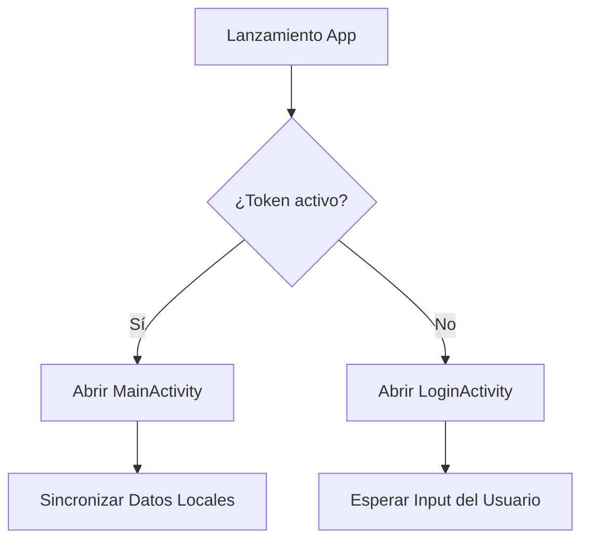
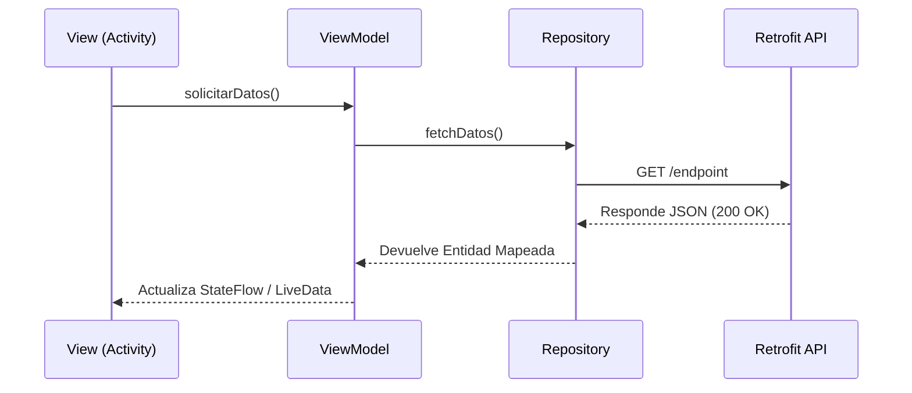
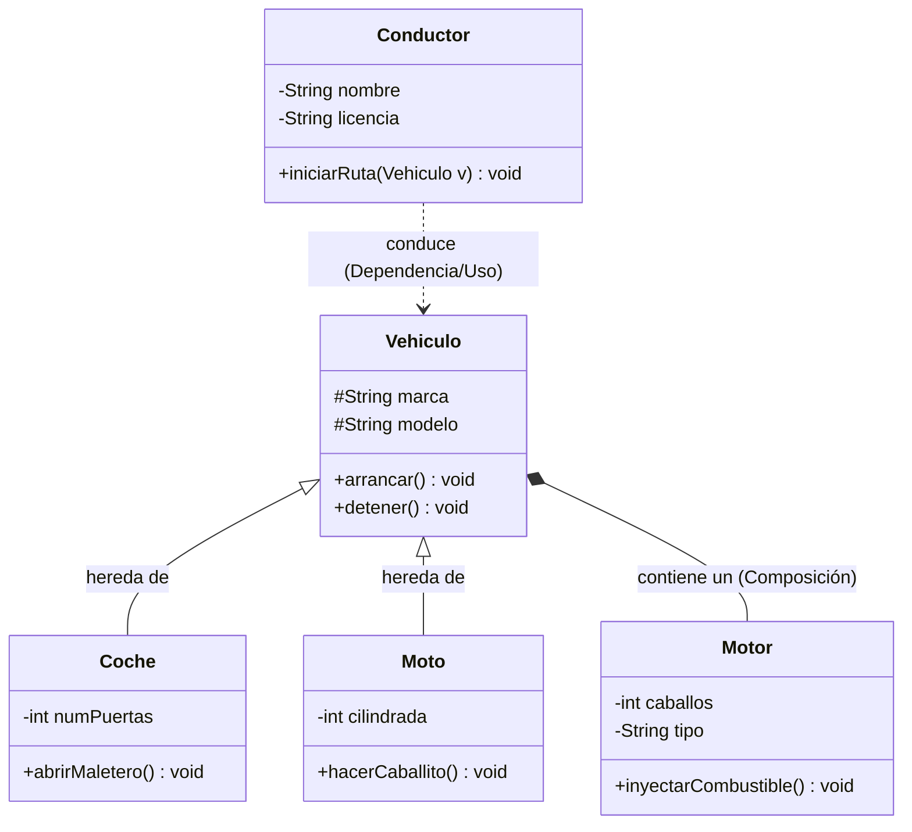

Una de las premisas pedagógicas y técnicas de la filosofía *Docs-as-Code* es evitar depender en la medida de lo posible de imágenes estáticas (PNG, JPG) para representar esquemas. Si un proceso de examen o despliegue cambia e invalida un bloque de tus apuntes, retocar una imagen externa en Photoshop o Draw.io te penalizará gravemente la agilidad durante el curso escolar.

Con la integración de **Mermaid** dibujamos la arquitectura lógica en simple texto plano (Markdown), y Docusaurus se encarga directamente de interpretar e ilustrar esos vectores dinámicamente en el navegador del alumno.

## Habilitar Mermaid

A diferencia del núcleo de Prism, Mermaid es manejado por un tema auxiliar oficial que debemos integrar obligatoriamente en Docusaurus. Instálalo desde el directorio raíz con tu terminal local:

```bash
npm install @docusaurus/theme-mermaid
```

Una vez descargado el paquete, debes autorizar su uso en tu fichero referencial `docusaurus.config.ts`. Es necesario habilitar la orden predeterminada en `markdown`, e inyectar el tema visual `themes`:

```javascript title="docusaurus.config.ts" 
const config = {
  // habilitar la sintaxis de markdown a mermaid
  // highlight-start
  markdown: {
    mermaid: true,
  },
  // inyectar la librería visual renderizadora
  themes: ['@docusaurus/theme-mermaid'],
  // highlight-end

  presets: [
    // ...resto del archivo config predeterminado
```

:::tip[Restablecimiento de Caché]
Como has enlazado un módulo totalmente nuevo en el núcleo de Docusaurus, recuerda cerrar el servidor activo y arrancar de nuevo con `npm run start`.
:::

## Catálogo de Diagramas Soportados

La librería de Mermaid abarca una amplia variedad de dominios técnicos que aportan versatilidad a los diferentes módulos de clase:

- **Diagramas de Flujo (Flowcharts)**: Representación de algoritmos básicos y tomas de decisiones paso a paso.
- **Gráficos de Secuencia (Sequence)**: Óptimos para trazar comunicación asíncrona, flujos HTTP o intercambio de mensajes entre sistemas Cliente/Servidor.
- **Diagramas de Clase (UML)**: Fundamentales al impartir Programación Orientada a Objetos para esquematizar atributos, métodos, herencia y composición entre clases Java, C#, etc.
- **Diagramas de Estado (State)**: De gran valor al enseñar el ciclo de vida de aplicaciones (como el paso de estados de un Activity en Android), o máquinas de estado.
- **Mapas Conceptuales (Mindmaps)**: Muy útiles al comienzo o final de cada tema para hacer resúmenes jerárquicos.
- **Diagramas de Gantt**: Ideales para proyectos integrados, FCT o asignaturas transversales como EIE (Empresa e Iniciativa Emprendedora) para organizar cronogramas.

Docusaurus interpretará nativamente cualquiera de ellos con solo abrir la etiqueta \`\`\`mermaid. Puedes consultar la sintaxis formal de dibujo de los mismos en la [documentación oficial de Mermaid](https://mermaid.js.org/).

### Diagramas de Flujo 

El flujograma es la columna vertebral esquemática en los inicios de cualquier ciclo en programación. Construiremos este recurso declarando `graph TD` (de Arriba hacia Abajo) o `graph LR` (de Izquierda a Derecha), delineando cada bloque a través de operadores en flecha (`-->`).

````md

````

**Resultado en el navegador del código anterior:**


### Gráficos de Secuencia 

Resultan imprescindibles para ilustrar modelos estructurales Cliente-Servidor, APIs REST u OAuth. Únicamente hay que definir los elementos `participant` y comunicar asíncronamente sus colas de respuesta:

````md

````

**Resultado en el navegador del código anterior:**


### Diagramas de Clase (UML)

En los módulos de Programación Orientada a Objetos, plasmar la herencia y el polimorfismo entre nuestras entidades es el pilar de la asignatura. Mermaid nos permite declarar la herencia (`<|--`), la composición (`*--`), el uso de dependencias (`..>`) y la visibilidad de los métodos (`+` público, `-` privado, `#` protegido) de forma totalmente visual. 

El siguiente ejemplo demuestra el caso de estudio clásico de Java: herencia de la clase `Vehiculo`, agregación/composición introduciendo la parte obligatoria `Motor`, y una dependencia laxa mostrando cómo interacciona un `Conductor`.

````md

````

**Resultado en el navegador del código anterior:**


