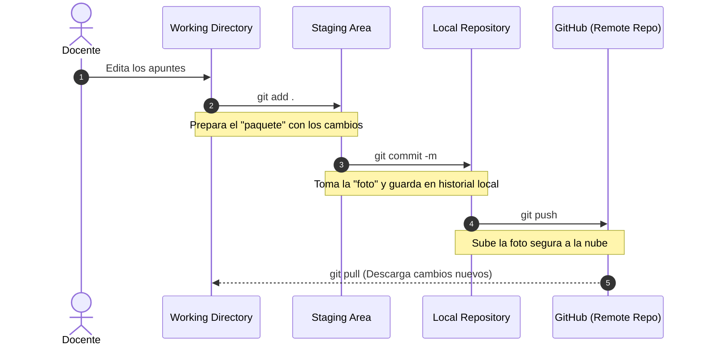

Una vez instalado Git y configurada nuestra cuenta, es el momento de entender cómo "viajan" nuestros apuntes desde que guardamos el archivo en nuestro ordenador hasta que aterrizan en GitHub.

## Las Áreas de Trabajo de Git

Para evitar subir código roto o documentos a medias, Git divide el flujo en diferentes áreas (o estados de archivo). Entender este diagrama es el 90% del éxito al aprender a controlar versiones.



:::info[¿Cuándo necesito hacer Pull?]
El comando `git pull` (Arrastrar / Sincronizar) solo es estrictamente necesario en dos escenarios:
1. Si estás colaborando en equipo con **varias personas** dentro de este mismo repositorio.
2. Si como docente acostumbras a trabajar desde **varios ordenadores distintos** (por ejemplo: el PC del instituto y tu PC de casa).

Si vas a desarrollar el temario tú solo y siempre en un mismo ordenador principal, tu flujo más habitual será simplemente hacer `git push` regularmente para preservar tu copia de seguridad en la nube.
:::


## Configuración Inicial y Primer Despliegue

La primera vez que arranques tu proyecto con Git, tendrás que realizar el recorrido secuencial completo por todas las fases para dejarlo preparado.

### Inicializar el Repositorio (Infraestructura)

Para que Git empiece a vigilar tus archivos, debes inicializar el repositorio por primera vez. Esto solo se hace una vez por proyecto.

**Por Comandos (Terminal):**
Abre la terminal en la raíz de tu proyecto de Docusaurus y ejecuta:
```bash
git init
```

**Por Interfaz Visual (IDE):**
1. Ve al panel de **Control de Código Fuente** (el icono de ramificación en la barra lateral izquierda).
2. Haz clic en el botón azul **Initialize Repository** (o Inicializar Repositorio).

### Preparar Cambios (Staging Area)

Cuando editas o creas un archivo Markdown, Git lo detecta. Pero estos cambios no se guardan de golpe; debes elegir cuáles quieres "empaquetar".

:::tip[El comando más chivato]
Usa `git status` en la terminal en cualquier momento. Te dirá exactamente qué archivos se han modificado (saldrán en rojo) y cuáles están ya preparados en el *Staging* (saldrán en verde).
:::

**Por Comandos:**
Para añadir todos los cambios de golpe al paquete, usamos el punto:
```bash
git add .
```

**Por Interfaz Visual:**
1. En el panel de **Control de Código Fuente**, verás una lista de archivos modificados bajo la pestaña *Changes*.
2. Haz clic en el icono **+** (Stage All Changes) al lado de "Changes", o en el **+** individual de cada archivo si solo quieres subir ficheros concretos.

### Guardar en el Historial (Commit)

El *Commit* es como tomar una fotografía inmutable de tu "Staging Area". Requiere un mensaje explicativo para que, en el futuro, tus compañeros (o tu yo del mes que viene) sepan qué hiciste.

**Por Comandos:**
```bash
git commit -m "Añadido el login con Google de la UT5"
```

**Por Interfaz Visual:**
1. Una vez los archivos estén listados bajo *Staged Changes*.
2. Escribe tu mensaje descriptivo en la caja de texto superior del panel.
3. Haz clic en el botón **Commit**.

### Vincular con la Nube (Infraestructura)

Para enviar la foto que hemos tomado (commit) a la nube, primero debemos crear un "cubo vacío" en nuestra cuenta de GitHub y luego enlazarlo con nuestro ordenador local.

#### 1. Crear el repositorio en GitHub
1. Inicia sesión en [GitHub.com](https://github.com/).
2. Haz clic en el icono **+** (arriba a la derecha) y selecciona **New repository**.
3. Rellena el **Repository name** (por ejemplo: `apuntes-docusaurus`).
4. Déjalo en **Public** para que se pueda publicar en GitHub Pages, y **NO marques** ninguna casilla de inicialización (ni *Add a README*, ni `.gitignore`). El repositorio debe nacer completamente vacío para evitar conflictos.
5. Haz clic en **Create repository**.


:::important[El nombre define tu futura web]
El **Repository name** que elijas determinará el enlace público definitivo de tus apuntes a través de GitHub Pages (por ejemplo: `https://tu-usuario.github.io/nombre-del-repositorio/`). Es vital que uses minúsculas, sin tildes ni espacios sueltos. Además, más adelante veremos que **este nombre deberá coincidir exactamente** con la variable `baseUrl` en la configuración de la web.
:::

#### 2. Enlazar ambos mundos

En la pantalla siguiente que te mostrará GitHub, verás varias opciones. Dirígete a la sección titulada **"...or push an existing repository from the command line"**.

De todos los comandos descritos, copia y pega en la terminal de tu IDE **únicamente las tres líneas siguientes** (señaladas en la captura):


Estos tres comandos se encargarán de establecer tu rama principal como *main*, conectar la URL del repositorio remoto y realizar la primera gran subida (*Push*) de tus archivos.


### Sincronizar (Push y Pull)

La última frontera. Un **Push** empuja tus commits locales hacia GitHub. Un **Pull** arrastra los commits de GitHub (si un compañero hizo cambios o editaste algo desde la web) hacia tu ordenador local.

**Por Comandos:**
Para subir los cambios:
```bash
git push
```
Para traer cambios nuevos de la nube antes de empezar a trabajar (buena práctica):
```bash
git pull
```

**Por Interfaz Visual:**
1. En el panel de Control de Código Fuente, el gran botón de "Commit" se habrá transformado en **Sync Changes** (Sincronizar Cambios) con un icono numérico.
2. Si haces clic, el IDE ejecutará automáticamente un *Pull* seguido de un *Push* sin que tengas que teclear nada.

## Resumen del Flujo Habitual

¡No te abrumes con tanta terminología! Aunque hayamos visto un montón de comandos, es muy importante tener claro que **Inicializar el repositorio** y **Vincularlo con la Nube** es un trabajo de "infraestructura" que se realiza **exclusivamente una vez** (al fundar tu manual de apuntes).

En tu trabajo del día a día redactando, el flujo habitual que repetirás en bucle se reduce a estos cuatro sencillísimos pasos:

1. Modificas o creas uno de tus ficheros Markdown (*Guardar archivo*).
2. Empaquetas los cambios en el Staging (`git add .`).
3. Generas la foto en tu historial para registrar tu avance (`git commit -m "Explicación breve"`).
4. Sincronizas con GitHub para asegurarlo en la nube (`git push` / botón *Sync Changes*).