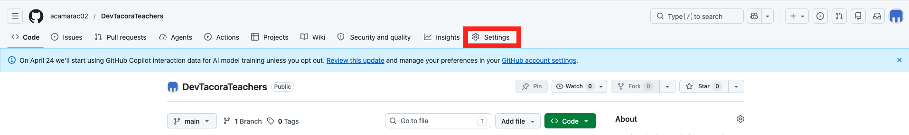

En este apartado documentaremos el proceso para publicar nuestros apuntes en internet a voluntad. Aunque la automatización total es potente, en el ecosistema educativo suele ser preferible conservar el control manual sobre **cuándo** se publican los cambios a producción. De ese modo, podemos guardar nuestro trabajo de resúmenes o borradores en GitHub sin peligro de que los alumnos lo lean prematuramente.

Por ello, utilizaremos el comando nativo de despliegue de Docusaurus: compilará y publicará la web en **GitHub Pages** únicamente en el momento que nosotros lo ordenemos explícitamente.

## Configuración de Docusaurus

Antes de poder realizar el despliegue, debemos ajustar ciertos parámetros en el núcleo de Docusaurus para que entienda en qué dominio y ruta vivirá el sitio al estar público. Abre tu `docusaurus.config.js` y edita las siguientes variables en la raíz de tu configuración:

```javascript title="docusaurus.config.js"
const config = {
  // Dominios y rutas de producción
  url: 'https://TU-USUARIO.github.io', // Cambia TU-USUARIO por tu nombre en GitHub
  baseUrl: '/NOMBRE-DEL-REPO/', // Nombre exacto de tu repositorio. Observa las barras "/"

  // Metadatos requeridos por el script de despliegue
  organizationName: 'TU-USUARIO', // Usualmente tu nombre de usuario de GitHub
  projectName: 'NOMBRE-DEL-REPO', // Nombre del repositorio
  deploymentBranch: 'gh-pages', // Rama oculta que creará Docusaurus para alojar la web
  trailingSlash: false, 
  
  // ...resto de opciones de Docusaurus...
```

:::info[Sobre el mapeo baseUrl]
Al alojar este proyecto en tu propia cuenta formativa de GitHub, la URL resultante no es un dominio absoluto sino que cuelga sobre tu nombre (`.io/repo/`). Por ello es mandatorio preservar la propiedad `baseUrl` rodeada de barras invertidas (`/`).
:::

## Entorno de Repositorio (Paso Único)

Debemos configurar nuestro repositorio en GitHub para indicarle que el origen visual de la página web será la rama donde Docusaurus volcará el resultado. Esta acción de mantenimiento solo recae en nosotros la primera vez:

1. Ingresa a la página principal de tu repositorio específico en [GitHub.com](https://github.com) (por ejemplo: `github.com/tu-usuario/tu-repo`).
2. Dirígete a la pestaña **Settings** (Ajustes) que aparece en el menú horizontal del propio repositorio (junto a *Code*, *Issues*, *Pull requests*, etc.). **Importante:** No debes pulsar en los *Settings* globales de tu perfil de usuario situados arriba a la derecha.



3. Tras entrar, en el menú lateral izquierdo, haz clic en **Pages**.
4. En la sección **Build and deployment**, busca el menú desplegable asignado al parámetro **Source** y asegúrate de elegir la opción clásica **Deploy from a branch**.
5. Justo debajo, en el bloque **Branch**, selecciona la rama que hemos bautizado como `gh-pages` y pulsa **Save**. 

*(Nota: Si GitHub no te permite seleccionar la rama `gh-pages` porque afirma que "no existe", significa simplemente que debes esperar a lanzar el comando de despliegue de la siguiente sección por primera vez para que Docusaurus la genere automática).*

## Operación de Despliegue (Publish)

Cuando certifiques que tus apuntes están listos para ser consumidos por el aula y quieras publicarlos, el proceso consiste exclusivamente en ejecutar la orden de publicación local.

Abre la terminal integrada en tu editor y lanza el proceso estandarizado de compilación. Por defecto, Docusaurus detectará inteligentemente las credenciales de GitHub que ya usamos a diario en nuestro flujo de trabajo:

```bash
npm run deploy
```

*(Nota de seguridad: Si en un futuro cambias de ordenador o la consola informa de problemas de permisos por tener varias cuentas de Github cruzadas, puedes forzar empíricamente el usuario prefijando la variable de esta forma: `GIT_USER=TU-USUARIO npm run deploy`).*

### Analizando el comando de despliegue
En cuestión de un minuto, esta instrucción unificada realizará el siguiente listado de tareas invisibles en tu máquina local:
1. Construirá y empaquetará una versión ultraligera y cacheable de todos tus archivos Markdown y componentes React (exactamente igual que usar `npm run build`).
2. Traspasará ese resultado minificado en la rama aislada `gh-pages`.
3. Hará el empuje (*push*) automático de esa pequeña rama sobre el repositorio remoto público de GitHub, desencadenando la exposición inmediata del temario web. 
4. Garantizará que la rama esencial de trabajo (`main`) se mantenga inmaculada como simple código fuente, a salvo de basura de compilación.
