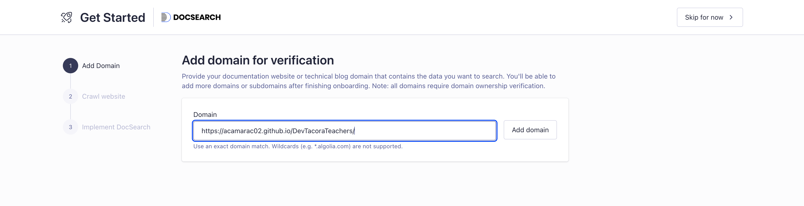

Cuando nuestro temario empieza a crecer, añadir un buscador integrado se vuelve casi obligatorio. Ayudaremos a los estudiantes a localizar conceptos rápidamente para repasar, igual que hacen los desarrolladores en la documentación técnica profesional.

En este manual vamos a configurar **Algolia DocSearch**, que es el motor de búsqueda gratuito que los propios creadores de Docusaurus recomiendan y traen preparado por defecto.

## Integración con Algolia paso a paso

Algolia utiliza un rastreador en sus servidores que lee automáticamente tu página web cuando la publicas y construye un índice. Esto permite ofrecer autocompletado y sugerencias casi instantáneas, siendo totalmente gratis y sin cargar el rendimiento de nuestra página web.

### 1. Registrarse y solicitar el rastreo

Como es un servicio gratuito reservado exclusivamente para páginas de documentación abierta, tenemos que enviarles la dirección web de nuestros apuntes para que verifiquen que somos un proyecto educativo:

1. Entra en la web de [Algolia DocSearch](https://docsearch.algolia.com/) y regístrate.
2. Una vez dentro, accederás a un sencillo asistente de creación (*wizard*) donde deberás rellenar **la dirección web final (URL)** donde ya tienes desplegados tus apuntes. Por ejemplo, en el caso de este curso sería `https://acamarac02.github.io/DevTacoraTeachers/`.
   
   

3. Tras enviar el formulario, el equipo de Algolia revisará tu web (suele tardar menos de 48 horas) y te enviará un correo electrónico de confirmación. En ese email te facilitarán tres claves vitales que necesitamos para conectar el buscador: `appId`, `apiKey` e `indexName`.

### 2. Configurar Docusaurus

Abre tu archivo `docusaurus.config.js` y busca el gran bloque llamado `themeConfig`.

Solo tenemos que añadir una nueva sección llamada `algolia` dentro de ese bloque y rellenarla con los datos del mail. Al hacer esto, Docusaurus "pintará" la barra de búsqueda sola:

```javascript title="docusaurus.config.js"
const config = {
  // ...
  themeConfig: {
    // highlight-start
    algolia: {
      // 1. Sustituye estos textos por las tres claves que te mandaron al e-mail
      appId: 'IDENTIFICADOR_1X',
      apiKey: 'APIKEY_PUBLICA_BUSQUEDA',
      indexName: 'NOMBRE_CLAVE_MODULO',
      
      // 2. Fundamental dejar esto en true si tienes también la web en inglés
      contextualSearch: true,
      
      // 3. Recomendado - Filtros extra (déjalo vacío si no lo controlas)
      searchParameters: {},
    },
    // highlight-end
    navbar: {
      title: 'DevTacora Teachers',
      // ...
```

### 3. Prueba el Buscador en Local

:::tip[¡Aviso! Reinicia tu servidor]
Cambios profundos como el buscador o colores principales necesitan que reinicies el entorno. En la terminal donde estés previsualizando el proyecto, pulsa `Ctrl+C` para detenerlo y vuelve a escribir `npm run start`.
:::

Si no hay fallos al arrancar, verás que ha aparecido un botón de "Buscar" en la parte derecha del menú de navegación de tu web. 

A partir de ahora, tanto tú como los alumnos podréis hacer clic en ella, o mejor aún, usar el atajo universal de teclado `Ctrl + K` (o `Cmd + K` en Mac) para encontrar cualquier palabra o apartado perdido del temario de forma inmediata.
